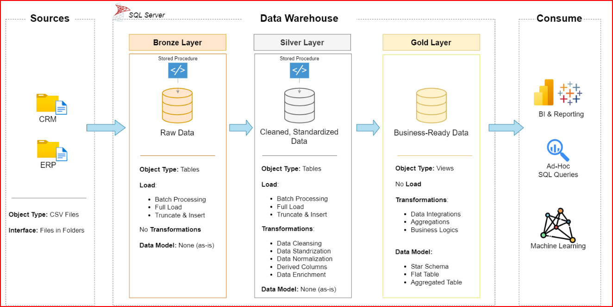

# SQL Data Warehouse Project
**Modern Data Warehouse & Analytics using SQL Server**

## 📌 Overview

This project demonstrates the end-to-end design and implementation of a modern **Data Warehouse** using **SQL Server**, covering **ETL pipelines, data modeling, and analytical reporting**.

Built using real-world data engineering practices, this repository reflects **3+ years of hands-on Data Engineering experience** in building scalable, analytics-ready platforms aligned with business requirements.

---

## 🏗️ Data Architecture

The solution follows the **Medallion Architecture** pattern:

### 🟤 Bronze Layer
- Raw data ingestion from source systems (ERP & CRM)
- CSV files loaded into SQL Server
- Schema-on-read approach
- No transformations applied

### ⚪ Silver Layer
- Data cleansing and standardization
- Handling nulls, duplicates, and data quality issues
- Business rule validation
- Conformed dimensions preparation

### 🟡 Gold Layer
- Business-ready analytical layer
- Star schema (Fact & Dimension tables)
- Optimized for BI, reporting, and ad-hoc analytics

---

## 🎯 Project Objectives

- Design a production-grade data warehouse
- Build robust SQL-based ETL pipelines
- Integrate multiple source systems into a unified data model
- Enable fast and reliable analytical queries
- Deliver actionable business insights

---

## 🛠️ Tech Stack

- **Database:** SQL Server (Express)
- **Query Language:** T-SQL
- **ETL:** SQL-based transformations
- **Data Modeling:** Star Schema
- **Version Control:** Git & GitHub
- **Documentation:** Markdown, Draw.io

---

## 📂 Data Sources

- **ERP System:** Sales transactions and product data
- **CRM System:** Customer and sales interaction data
- Source format: CSV files
- Scope limited to latest snapshot data (no historization)

---

## 📐 Data Modeling

### Fact Tables
- Sales Fact (revenue, quantity, discounts)

### Dimension Tables
- Customer
- Product
- Date
- Sales Territory

Designed to support:
- Time-based analysis
- Customer segmentation
- Product performance tracking

---

## 🔄 ETL Workflow

1. **Extract**
   - Load raw CSV data into Bronze tables

2. **Transform**
   - Cleanse and standardize data in Silver layer
   - Apply business logic and validations

3. **Load**
   - Populate Gold layer star schema
   - Enforce referential integrity
   - Optimize for analytical queries

---

## 📊 Analytics & Reporting

SQL-based analytics enable insights into:
- Customer purchasing behavior
- Product performance trends
- Sales growth and seasonality
- Revenue contribution by segment

Gold layer tables are BI-tool ready (Power BI / Tableau).

---

## 📁 Repository Structure

